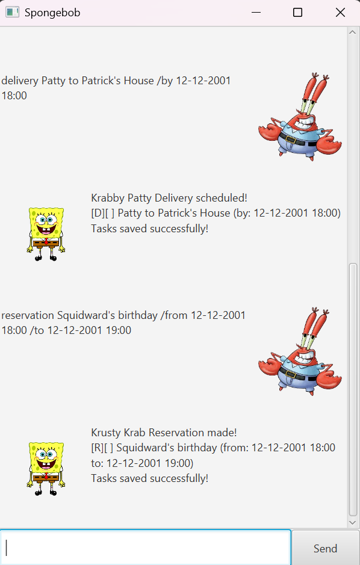

# Spongebob User Guide

Spongebob is your personal assistant in the Krusty Krab, designed to help you manage any tasks such as
orders, deliveries or reservations with ease. The main interface is a command-line based interface, where you can
add, delete, mark, unmark, find, list and undo your tasks.



# Features

**Notes about the command formats:**

- Keyword commands (the first word) are not case-sensitive, e.g. so `order` and `ORDER` are both valid.
- Arguments (the part after the keyword) are case-sensitive, e.g. so `order Krabby Patty` and `order krabby patty` are not the same.
- Words in `<UPPER_CASE>` are placeholders for the actual arguments, e.g. `<ORDER_DETAILS>` should be replaced with the actual details of the order you want to add.

## Adding Orders: `order`

Adds an **unmarked** order to your list of tasks.

Format: `order <ORDER_DETAILS>`

Example: `order Krabby Patty`

Expected Output:

```
Krabby Patty Order received!
[O][ ] Krabby Patty
Tasks saved successfully!
```

## Adding Deliveries: `delivery`

Adds an **unmarked** delivery to your list of tasks.

Format: `delivery <DELIVERY_DETAILS> /by <DEADLINE>`
Note: `DEADLINE` should be in the format of `dd-MM-yyyy HH:mm`, e.g. `12-12-2024 18:00`

Example: `delivery to Patrick's house /by 12-12-2024 18:00`

Expected Output:

```
Krabby Patty Delivery scheduled!
[D][ ] to Patrick's house (by: 12-12-2024 18:00)
Tasks saved successfully!
```

## Adding Reservations: `reservation`

Adds an **unmarked** reservation to your list of tasks.

Format: `reservation <RESERVATION_DETAILS> /from <START_TIME> /to <END_TIME>`
Note: `START_TIME` and `END_TIME` should be in the format of `dd-MM-yyyy HH:mm`, e.g. `12-12-2024 18:00`

Example: `reservation table for 4 /from 12-12-2024 18:00 /to 12-12-2024 20:00`

Expected Output:

```
Krusty Krab Reservation made!
[R][ ] table for 4 (from: 12-12-2024 18:00 to: 12-12-2024 20:00)
Tasks saved successfully!
```

## Marking Tasks as Done: `mark`

Marks a task in your list of tasks as **done**.

Format: `mark <TASK_NUMBER>`
Note: `TASK_NUMBER` is the number corresponding to the task (1-indexed) in your list of tasks,
which can be found using the [`list`](#listing-tasks-list) command.

Example: `mark 1`

Expected Output:

```
Task complete!
[O][X] Krabby Patty
Tasks saved successfully!
```

## Unmarking Tasks as Not Done: `unmark`

Unmarks a task in your list of tasks as **not done**.

Format: `unmark <TASK_NUMBER>`
Note: `TASK_NUMBER` is the number corresponding to the task (1-indexed) in your list of tasks,
which can be found using the [`list`](#listing-tasks-list) command.

Example: `unmark 1`
Expected Output:

```
Task cancelled!
[O][ ] Krabby Patty
Tasks saved successfully!
```

## Listing Tasks: `list`

Lists all the tasks in your list of tasks.

Format: `list`
Note: This command expects no additional arguments

Expected Output:

```
Here are the tasks in your Krusty Krab task list:
Krabby Patty Task 1: [O][ ] Krabby Patty
Krabby Patty Task 2: [D][ ] to Patrick's house (by: 12-12-2024 18:00)
Krabby Patty Task 3: [R][ ] table for 4 (from: 12-12-2024 18:00 to: 12-12-2024 20:00)
```

## Finding Tasks: `find`

Finds tasks in your list of tasks that contain a specific keyword.
Format: `find <KEYWORD>`
Note: `KEYWORD` is not case-sensitive, e.g. so `find krabby` and `find Krabby` will yield the same results.

Example: `find Krabby`
Expected Output:

```
Here are the matching tasks in your Krusty Krab task list:
[O][ ] Krabby Patty
```

## Deleting Tasks: `delete`

Deletes a task from your list of tasks.

Format: `delete <TASK_NUMBER>`
Note: `TASK_NUMBER` is the number corresponding to the task (1-indexed) in your list of tasks,
which can be found using the [`list`](#listing-tasks-list) command.

Example: `delete 1`

Expected Output:

```
Task removed!
[O][ ] Krabby Patty
Tasks saved successfully!
```

## Undoing Previous Command: `undo`

Undoes the previous command that modified the list of tasks, reverting it to the state before that command was executed.
Format: `undo`
Note: This command expects no additional arguments. Only commands that modify the list of tasks (
e.g. `order`, `delivery`, `reservation`, `mark`, `unmark`, `delete`) can be undone using this command.

Example:

- `order Kraby Patty`
- `undo`

Expected Output after `undo`:

```
Last action undone successfully!
Tasks saved successfully!
```

## Saving Tasks

All tasks are automatically saved to a file named `orders.txt` in the relative folder `./data` as the application
after any command that modifies the list of tasks is executed (e.g. `order`, `delivery`, `reservation`, `mark`,
`unmark`, `delete`, `undo`).

# Command Summary

| Command       | Format                                                                | Example                                                               | Description                                                                                                              |
| ------------- | --------------------------------------------------------------------- | --------------------------------------------------------------------- | ------------------------------------------------------------------------------------------------------------------------ |
| `order`       | `order <ORDER_DETAILS>`                                               | `order Krabby Patty`                                                  | Adds an unmarked order to your list of tasks.                                                                            |
| `delivery`    | `delivery <DELIVERY_DETAILS> /by <DEADLINE>`                          | `delivery to Patrick's house /by 12-12-2024 18:00`                    | Adds an unmarked delivery to your list of tasks.                                                                         |
| `reservation` | `reservation <RESERVATION_DETAILS> /from <START_TIME> /to <END_TIME>` | `reservation table for 4 /from 12-12-2024 18:00 /to 12-12-2024 20:00` | Adds an unmarked reservation to your list of tasks.                                                                      |
| `mark`        | `mark <TASK_NUMBER>`                                                  | `mark 1`                                                              | Marks a task in your list of tasks as done.                                                                              |
| `unmark`      | `unmark <TASK_NUMBER>`                                                | `unmark 1`                                                            | Unmarks a task in your list of tasks as not done.                                                                        |
| `list`        | `list`                                                                | `list`                                                                | Lists all the tasks in your list of tasks.                                                                               |
| `find`        | `find <KEYWORD>`                                                      | `find Krabby`                                                         | Finds tasks in your list of tasks that contain a specific keyword.                                                       |
| `delete`      | `delete <TASK_NUMBER>`                                                | `delete 1`                                                            | Deletes a task from your list of tasks.                                                                                  |
| `undo`        | `undo`                                                                | `undo`                                                                | Undoes the previous command that modified the list of tasks, reverting it to the state before that command was executed. |
